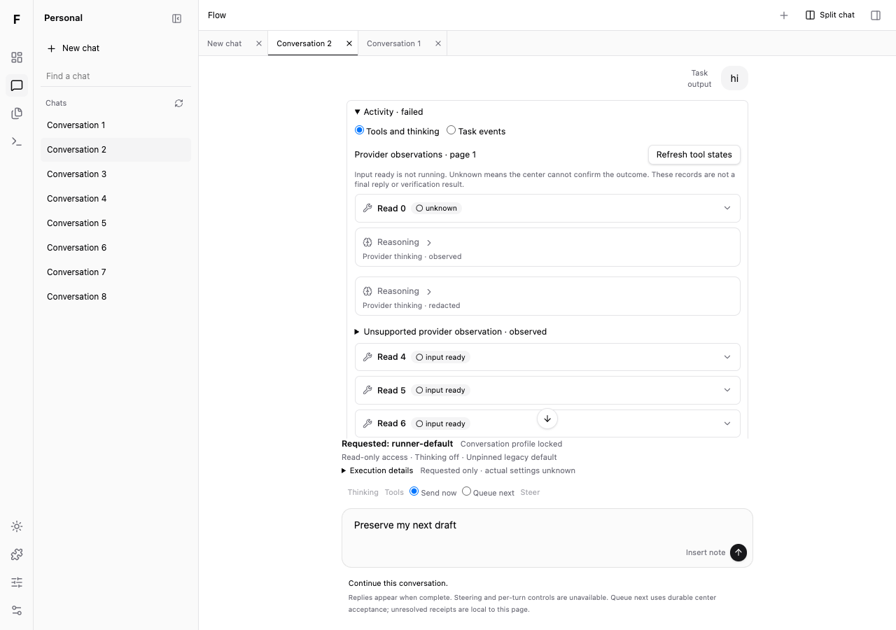
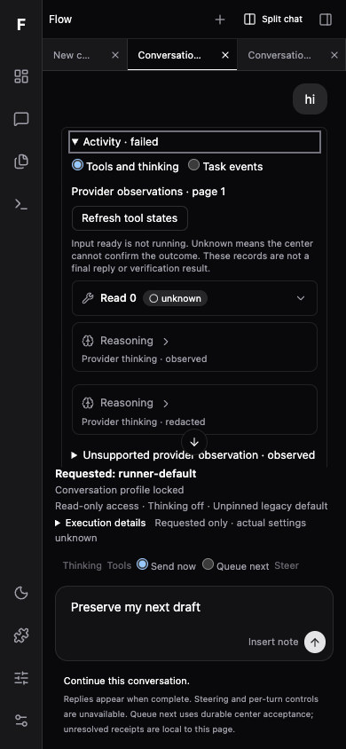

# WPF-ACTIVITYI01 聊天活动交付候选

当前固定实现：`ba341d77672ba8456197d64d54193aee79719e46`；首候选：`e93070cc08339325cd299105f5805ca871a07ea8`；基线：`86a36eaeffbf09f0a3772c3d1509c17dc0a76f92`。分支 `codex/web-conversation-activity-integration`。root独立review对原e930提出ACTIVITYI-R1 P2；ba341已修复并通过针对性检查，待复审，主线未接收。见[修复检查](revision.md)。

聊天每轮用户消息下方现在有一直可见的活动入口。展开Tools and thinking读取最多20条轻记录，Tool/Reasoning逐条展开才读正文；Task events走既有通用阅读器。工具input-ready与running/unknown分别显示，思考只来自真实provider类型记录，不造时长。P01 footer实际含按钮、菜单、面板；更换中心、关闭或隐藏pane使旧读取失效，两可见split不互相依赖焦点。

## 输入与范围

自有15实现/测试路径及2受控依赖路径见[source-manifest.json](source-manifest.json)。C03原目标889f433ef6972e4feee95aa878f0dbaf7da30448仅两文件cherry-pick为07da10c37f50b5e787e21bbd45ceeda1fe539766；两before/after SHA256逐项核准，未修改其实现，也未复制其文档。见[cursor-dependency.json](cursor-dependency.json)。这项输入不扩大本owner写权。

首候选e930的17文件与两完整browser报告hash相同；当前ba341的17文件与两离线专项报告hash相同。开发报告运行于依赖HEAD07da+未提交实现，后来e930提交了相同字节；production报告明确运行于e930。没有将早期失败报告倒填为最终结果。

## 启动 / 预览

当前保留production HTTPfixture（reload加载ba341修复build）：<http://127.0.0.1:51454>。连接页Center URL留空，Owner token为公开合成fixture值 `flow-fixture-only`；备用中心51452/51453。0真实模型/产品DB，已有其他preview未停止。

从本worktree启动：

```sh
PATH=/opt/homebrew/opt/node@24/bin:$PATH pnpm --filter @flow/web build
PATH=/opt/homebrew/opt/node@24/bin:$PATH pnpm exec tsx apps/web/test/conversation-activity-integration.browser.ts --production --serve
```

系统分配新端口，以stdout为准。既有依赖用frozen lock安装；@flow/client/contracts均链接本树packages，rootmanifest/rootlock/shared零差异，无新依赖。

## 实际检查

- [74局部测试](module-tests.log)：native9、宿主adapter5、P01 16、受控C03通用44，全通过。
- [Typecheck](typecheck.log)与[production build](build.log)通过；现有chunk>500kB警告保留，未声称性能优化。
- [dev11组](development-browser.json)：10实际App旅程，加独立dev StrictMode+React.Activity。原生hidden与Activity清理分别有证据。
- [production10组](production-browser.json)：懒读/缓存、当前页状态刷新与显式历史、nativehidden、两split、真实menu/button/panel、停用不取消、390键盘/草稿、redacted/截断JSON、Queue Enter/button、换中心迟到body隔离。两报告pageErrors均空。
- 源码git diff --check通过；原始logs按原样保留，完整metadata diff可能包含工具输出空白，不将其清洗成漂亮结果。

首次browser因错误主题locator退出（6核心组已过），[原日志](browser-first.log)与[原报告](browser-first.json)保留。随后聊天列表按钮locator也修成真实Chats，见[browser-navigation-locator.log](browser-navigation-locator.log)。新增order测试原构造还破坏nextCursor，先触发了正确cursor拒绝；修成一致cursor才隔离order验证，失败原件[module-order-fixture-failure.log](module-order-fixture-failure.log)保留，未降低断言。

## 截图





## 限制 / 交接

这是合成HTTPfixture，未跑真实中心/provider、模型、产品数据库、Firefox/Safari或屏读。原有bundle大小和已读分页/body线性缓存未优化。generic公共events没有abort参数，hide使等待/结果失效，不能声称底层HTTP均取消。每页最多20但历史显式访问仍会保留缓存；没有内存上界承诺。原文SHA仅标识完整内容，未对截断前缀宣称完整验证。

CHAT06流正文未消费，旧timeline跨版本兼容由Lead负责；未改C01会话projection、messages、queue、profile或公共contracts。主线集成还需Lead组合检查。详情见[Interface](interface.md)、[技能与clean-code](quality.md)、[权威status](../../../plans/wpf-activity-i01-integration/status.md)、[review](../../../plans/wpf-activity-i01-integration/review.md)。
