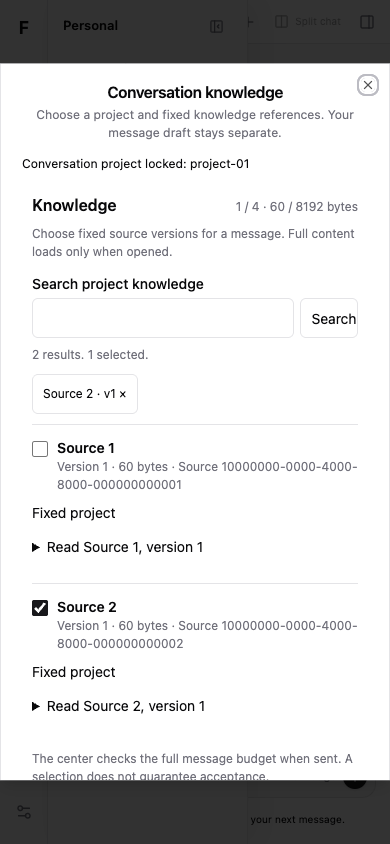
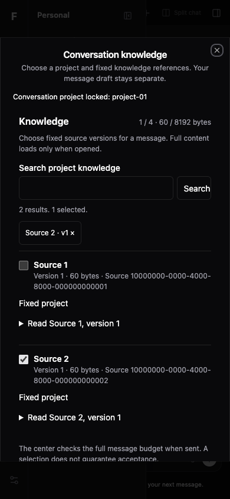

# 聊天知识接线验证

固定实现 `d0e05c26df6f331e0b1f15e7b738e4fe53208125`，基线 `d7e1e64e7792f4d1ad4933db042f10f266ad0cca`。本片将显式项目、零消息会话准备、知识选择和冻结引用接入真实 App 的 Send / Queue；不是本地文件上传或完整附件功能。独立 review 尚未开始，main 未集成。

## 可查看版本与重现

保留生产 HTTP fixture：<http://127.0.0.1:64537>。公开测试 token `flow-fixture-only`，仅合成 HTTP 数据、0 模型 / 产品 DB。开发预览 62865 亦保留；独立审查使用生产预览。

从此 worktree 根目录运行：

```sh
export PATH=/opt/homebrew/opt/node@24/bin:$PATH
pnpm --filter @flow/web typecheck
pnpm --filter @flow/web exec vitest run test/conversation-context-integration.test.ts test/conversation-outbox.test.ts test/conversation-projection.test.ts test/conversation-queue.test.ts test/plugin-host.test.ts
pnpm --filter @flow/web build
pnpm --filter @flow/web exec tsx test/conversation-context-integration.fixture.ts --context-preview
```

最后一条使用独立动态端口开发预览。生产预览使用同一 fixture 导出的 `startContextPreview(true)`；其返回 URL、公开 HTTP centers 与 `close()`，不改用户现有中心。

## 作者实际检查

| 检查 | 结果与来源 |
| --- | --- |
| 局部 / 直接依赖 | 144/144，5 文件，[原始日志](direct-tests.log) |
| Web types | 通过，[原始日志](typecheck.log) |
| 生产 build | 通过，既有大 chunk 警告保留，[原始日志](build.log) |
| 实际 App dev | 12 段通过，errors=[]，[原始 JSON](development-browser.json) / [日志](development-browser.log) |
| 实际 App production | 12 段通过，errors=[]，[原始 JSON](production-browser.json) / [日志](production-browser.log) |
| 来源绑定 | 十八个文件 current=fixed=两份 browser 报告，[manifest](source-manifest.json) / [独立字节核对](verification.json) |
| 保护范围 | Context01/02 helper、官方 Thread、ProfilePicker、ConversationQueue、stream、shared/client/root manifest/lock 无变化 |

浏览器完成了项目分页与空列表、CREATE ACK 丢失原键重试、零 turn prepare、懒正文 0→1→cache、Send 有序来源与 wrong ACK unknown、Queue Enter、disable 保留选择、无本地 receipt 时保留稿、预算拒绝新稿隔离、390 双主题 / 减动画 / 键盘、真实 native hidden / split、offline、换中心同 ID 隔离、legacy 纯文本。完整边界见 [接口说明](interface.md)。

## 双主题截图

作者实际目视生产截图；两图均绑定上述固定提交，不能当真实中心验证。





开发截图：[浅色](development-light-390.png)、[深色](development-dark-390.png)。

## 初轮失败与限定

`browser-first/second/third` 原始 JSON/log 保留：自动登录假设、标点 locator 与实际主题按钮名不匹配；修正测试后继续验证。`direct-first.log` 保留测试 manifest namespace 不匹配，`typecheck-first.log` 保留测试 fixture request.body 可选类型错误。未降低门禁或清洗原日志。`browser-fourth.log` / `browser-expanded.log` 为中间 7 / 10 段检查，最终结果以固定提交的 dev12/prod12 为准。源码 diffcheck0；原始日志 ANSI / 空白原样保存，不宣称整个证据 diff 无空白警告。

未验证真实中心、模型、产品 DB、Safari/Firefox/屏读；本地 receipt/草稿/引用不保证 reload 后恢复。没有新增 provider SDK/凭据耦合。build 大 chunk 警告仍在，没有性能收益声明。独立审查和 main 集成与作者测试分开记录。[技能与 clean-code](quality.md) · [计划](../../../plans/wpf-context-i01-integration/plan.md) · [状态](../../../plans/wpf-context-i01-integration/status.md) · [审查](../../../plans/wpf-context-i01-integration/review.md)
