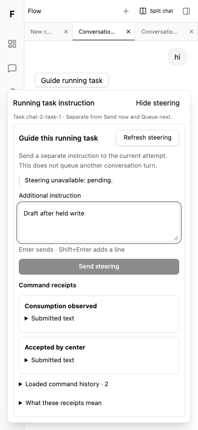
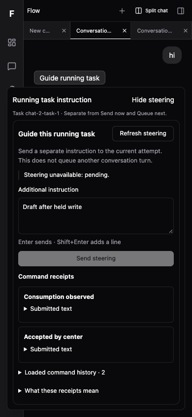

# 运行中指令接入交付

实现目标 **5cfebc639d7acd458d27f4543d00a32a9fd96fc7**，基线 **df29fb511df029a0922ace0f4973f3fe3736e502**，分支 `codex/web-steering-integration`。d01_owner 于 2026-10-06 09:50:22 UTC 独立 APPROVED；本片不是实际 provider 验收。

实际 App 在当前运行 turn 提供 Guide running task，使用原已审控制器/控件，独立于 Send/Queue 草稿；P01 唯一生命周期、private read/write授权、双 pane真实身份、八绑定背压、unknown原key、退出保护见[接口](interface.md)。[plan](../../../plans/wpf-steer-i01-integration/plan.md) / [status](../../../plans/wpf-steer-i01-integration/status.md) / [review](../../../plans/wpf-steer-i01-integration/review.md) 是唯一手填事实。

## 启动与预览

本树保留生产 HTTP fixture：**http://127.0.0.1:61475**。若显示连接页，公开测试 token 为 `flow-fixture-only`。打开 Conversation 2/3，再点 Guide running task。中心只模拟公开 HTTP，不是真实中心或 provider。所有旧预览保留。

```sh
cd /Users/citrine/Projects/AgentHarness/Flow-worktrees/web-steering-integration
PATH=/opt/homebrew/opt/node@24/bin:$PATH VITE_FLOW_FIXTURE=true pnpm --filter @flow/web build
PATH=/opt/homebrew/opt/node@24/bin:$PATH pnpm --filter @flow/web exec tsx test/conversation-steering-integration.fixture.ts --steering-app-preview --production
```

动态端口以输出为准。开发预览省略 `--production`。不需要新依赖，已有依赖以本树 `pnpm install --offline --frozen-lockfile --ignore-scripts` 安装，根 lock/manifest及protected模块无变化。

## 检查与固定来源

- [60局部/直接依赖](module-final.log)：8接线行为、33已审control回归、19PluginHost（含read声明不能授予write）；3files、exit0。先于实现commit运行，提交前后的11源字节由manifest核相同。
- [typecheck](typecheck-final.log) exit0；[生产build](build.log) exit0。既有大chunk警告仍在，不宣称性能改善。
- [开发真实App10组](development-browser.json) / [生产真实App10组](production-browser.json)：sourceCommit均为固定target，11hash全同，pageErrors=[]。覆盖注册0读、两个真实pane、hide/split/merge原draft、独立Send/Queue、unknown原键重试、offline迟到ACK、disable/enable、close/Delete取消与确认、换中心同ID新scope、server unavailable、390浅深/减少动画/键盘。
- [11源固定清单](source-manifest.json)：target=current=两browser报告；保护原STEER/Context/helpers/officialThread/projection/outbox/queue/stream/packages/rootmanifest-lock零diff。实际App native hidden +开发React StrictMode，不把原模块Activity fixture当App证明。
- [领取核验](claim-observation.json) / [原receipt](take-receipt.json) / [技能与clean-code](quality.md)。源码 `git diff --check` 为0；原始工具日志的空白/ANSI不清洗，完整metadata diff的原log例外与源码检查分开。





## 独立审查与首轮结果

d01_owner 独立 [60/60](independent-review-tests.log)（09:47:23 UTC，4.56s）及实际 CUA 窄旅程通过，11源与固定target一致，无blocking。实际检查和未重跑范围以 [review](../../../plans/wpf-steer-i01-integration/review.md) 为准，不把 root 转述当成 root 重跑。

## 首轮结果与未验证

保留 integration-first.log 中非法测试status `completed` 的失败；direct-tests.log 中漏必填manifest contributions的fixture失败；修复后60通过。browser-first至fourth记录依次为dev自动连接、Mac光标定位、窄屏未关闭已有sidebar造成的测试操作问题；不据此称产品回归。browser-fifth为未固定工作树9段PASS；最终固定10段以上述两JSON为准，未覆盖旧原始记录。

未验证真实中心/provider/DB、Safari/Firefox/屏读、reload/崩溃原key持久恢复、实际模型遵循指令。beforeunload只尽力提醒；用户确认离开会丢本页恢复，但不cancel中心任务。Accepted/Received/Consumption observed不等于模型采纳。main尚未集成，个人runtime未升级。WPF-MATURE-06完整成熟聊天目标仍有后继，不能用本片代称完成。
